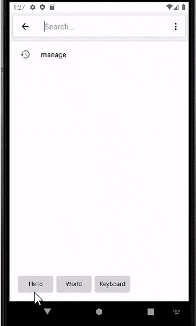
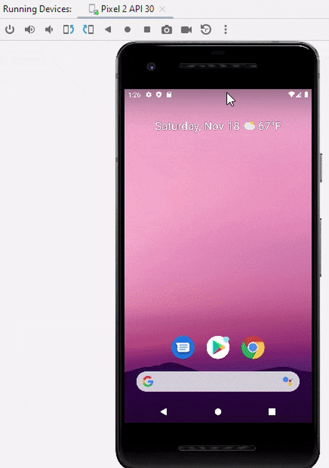

# Hello World Keyboard

Welcome to the Hello World Keyboard project! 
This custom Android keyboard is a perfect starting point for first-time Android developers interested in exploring custom keyboard development. 
The keyboard features three simple buttons that input "hello", "world", and "keyboard".

## Getting Started

These instructions will guide you through forking the project, making it your own, and setting up a development environment for testing and further development.

### Learn with ChatGPT
Use this custom GPT trained on this repo to learn more about the project and how to make your own keyboard!

<a href="https://chat.openai.com/g/g-i1y7EpBXV-helloworldkeyboard">
    Chat with HelloWorldKeyboard GPT
</a>

### Prerequisites

Before you start, ensure you have Android Studio installed, the official IDE for Android app development:

- [Install Android Studio](https://developer.android.com/studio/install)

### Setting Up Your Project from a Public Template

1. **Create Your Own Copy of the Repository**:
    - Navigate to the HelloWorldKeyboard project at `https://github.com/modularizer/helloworldkeyboard`.
    - Locate the `Use this template` button near the top of the page and click on it to generate a new repository in your GitHub account using HelloWorldKeyboard as a template.

2. **Set Up Your New Repository**:
    - Go to your GitHub profile to find the newly created repository.
    - Open this repository, and click on `Code` to reveal the clone options.
    - Copy the provided URL for cloning.

3. **Import the Project into Android Studio**:
    - Launch Android Studio.
    - Select `File` > `New` > `Project from Version Control`.
    - In the dialog box, enter the URL of your newly created repository in the URL field.
    - Choose a local directory where you want the project to be saved and click `Clone`.

### Running and Testing the Project in Android Studio for Beginners

1. **Setting Up an Emulator for Testing**:
   - Open Android Studio and navigate to `Tools` > `Device Manager`.
   - Click on `Create Device` to set up a new Android Virtual Device (AVD).
   - Select a device definition that resembles a common phone (e.g., Pixel 4) and choose a system image (preferably the latest available version of Android).
   - Follow the prompts to create the emulator. Once created, it will appear in your list of available devices.

2. **Configuring to Run the HelloWorldKeyboard Service**:
In Android Studio, go to `Run` > `Edit Configurations...` and set the `Launch Options` to `Nothing` and the `Launch` dropdown to `Nothing`. 
This is because unlike other apps, there is no "app" to launch for a keyboard, it is simply enabled in the system settings and activated when a text field is selected.

3. **Enabling and Testing the HelloWorldKeyboard**:
   - Start your emulator by selecting it in the AVD Manager and clicking on the green play button.
     - **NOTE:** Because it is a service, no app will be launched when you run the project. Instead, the keyboard will be enabled in the system settings.
   - Once the emulator is running, open the `Settings` app (you can find it by swiping up on the home screen and searching for 'Settings').
   - Navigate to `System` > `Languages & input` > `On-screen keyboard` > `Manage on-screen keyboards`.
   - Toggle on the `Hello World Keyboard`.
   - To test, open any app that allows you to type text. Click on a text field to bring up the keyboard.
   - If the default keyboard appears, switch to the HelloWorldKeyboard by tapping on the keyboard icon in the navigation bar and selecting 'Hello World Keyboard'.

**Note:** It's helpful to keep the README open as you go through these steps. If you encounter any difficulties, refer back to the detailed instructions provided.

## Customizing Your Keyboard
### Key Files for Customization
- `app/src/main/java/com.example.helloworldkeyboard/KeyboardService.kt`: Main service for keyboard logic.
- `app/src/main/res/keyboard_layout.xml`: Layout file for the keyboard UI.
- `app/src/main/res/values/strings.xml`: Strings file for keyboard UI text.
- `app/src/main/AndroidManifest.xml`: App declarations and configurations.

### Tips for Designing Your Keyboard
- **Layout**: Modify `keyboard_layout.xml` for UI changes.
- **Functionality**: Adapt `KeyboardService.kt` for different key actions.
- **Testing**: Always test changes on an emulator or device.

## Contributing

This project is open to contributions with the goal of making an absolute bare-bones keyboard for first-time Android developers,
encouraging best practices and good coding habits while also providing a starting point for further development.
Feel free to fork this repository, make your changes, and submit pull requests to contribute to this project.

## License

This project is 100% open source and free to use for any purpose.
This project is licensed under the [Unlicense](https://unlicense.org) - see the [LICENSE](LICENSE) file for details.

